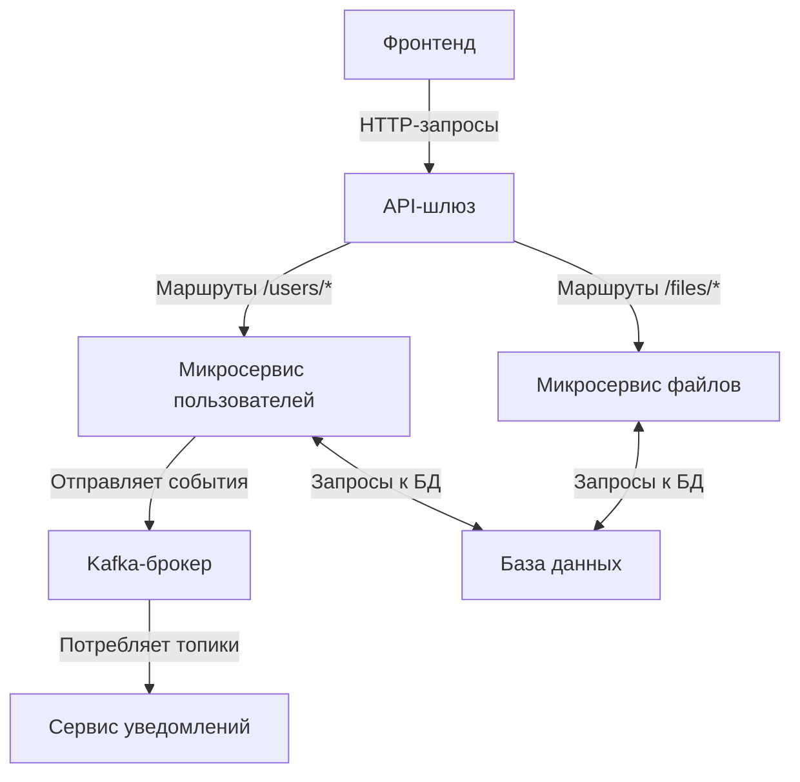

# Private File Sharing


Надежная, безопасная и масштабируемая платформа для приватного обмена файлами, разработанная для организаций, которым требуется детализированный контроль доступа, управление пользователями и бесшовные уведомления. Построена на основе микросервисной архитектуры для обеспечения высокой доступности, легкого масштабирования и удобной поддержки кода. Будь то работа с конфиденциальными документами или совместными файлами, приложение предоставляет ролевой доступ, аутентификацию через JWT и событийно-ориентированные уведомления.

## Основные возможности

- **Управление пользователями**: Регистрация, аутентификация и управление пользователями с ролями (admin, pro, default). Администраторы могут создавать, обновлять или удалять пользователей.
- **Управление файлами**: Загрузка, получение, изменение уровня доступа и удаление файлов (поддержка PDF, Word и т.д.). Доступ регулируется уровнями (default, pro, admin).
- **Безопасная аутентификация**: Логин на основе JWT с хешированием паролей и ролевым управлением доступом (RBAC).
- **Уведомления**: Уведомления пользователей в реальном времени через Kafka для событий, таких как передача файлов или обновления.
- **API-шлюз**: Централизованная точка входа для всех запросов, обеспечивающая маршрутизацию, CORS и балансировку нагрузки.
- **Масштабируемость**: Микросервисная архитектура позволяет независимо масштабировать сервисы для пользователей и файлов.

## Технологический стек

Проект использует современные технологии промышленного уровня для обеспечения производительности, безопасности и удобства для разработчиков. Основной акцент сделан на экосистему Java для надежности бэкенда и асинхронный обмен сообщениями для слабосвязанных сервисов.

### Бэкенд
<a href="https://www.java.com" target="_blank"></a>
<a href="https://spring.io/projects/spring-boot" target="_blank"></a>
<a href="https://spring.io/projects/spring-security" target="_blank"></a>
<a href="https://spring.io/projects/spring-data-jpa" target="_blank"></a>
<a href="https://spring.io/projects/spring-cloud-gateway" target="_blank"></a>
<a href="https://spring.io/projects/spring-kafka" target="_blank"></a>
<a href="https://kafka.apache.org" target="_blank"></a>
<a href="https://restfulapi.net" target="_blank"></a>

### База данных
<a href="https://www.postgresql.org" target="_blank"></a>

### Фронтенд
<a href="https://html.spec.whatwg.org" target="_blank"></a>
<a href="https://www.w3.org/Style/CSS" target="_blank"></a>
<a href="https://tailwindcss.com" target="_blank"></a>
<a href="https://developer.mozilla.org/docs/Web/JavaScript" target="_blank"></a>

### Сборка и деплой
<a href="https://maven.apache.org" target="_blank"></a>
<a href="https://www.docker.com" target="_blank"></a>
<a href="https://projectlombok.org" target="_blank"></a>

## Архитектура проекта

Проект построен на микросервисной архитектуре для модульности и изоляции ошибок. Фронтенд взаимодействует только с API-шлюзом, который маршрутизирует запросы к специализированным сервисам. Операции, связанные с пользователями, могут инициировать уведомления через Kafka для разделения ответственности.

### Поток обработки запросов
1. Фронтенд отправляет HTTP-запросы (например, логин, загрузка файла) на API-шлюз.
2. API-шлюз аутентифицирует (через JWT) и перенаправляет запрос к соответствующему микросервису.
3. Микросервис пользователей обрабатывает аутентификацию, CRUD-операции и отправляет события в Kafka для уведомлений.
4. Микросервис файлов управляет операциями с файлами и их хранением.
5. Сервис уведомлений потребляет Kafka-топики для отправки email или уведомлений в приложении.

### Схема архитектуры



Эта схема показывает поток запросов и событийно-ориентированное взаимодействие. API-шлюз выступает единой точкой входа, повышая безопасность и упрощая интеграцию с клиентом.

## Структура проекта

Репозиторий организован как мультимодульный Maven-проект для удобного управления микросервисами:

- **api-gateway/**: Содержит конфигурацию Spring Cloud Gateway, правила маршрутизации и фильтры безопасности.
  - `src/main/java`: Контроллеры/фильтры для обработки запросов.
  - `application.yml`: Конфигурация маршрутов (например, к сервисам пользователей и файлов).

## Установка и запуск

1. **Клонируйте репозиторий**:
   ```
   git clone https://github.com/vnikolaenko-dev/PrivateFileSharing.git
   cd PrivateFileSharing
   git checkout api-gateway
   ```

2. **Установите зависимости**:
   ```
   mvn clean install
   ```

3. **Настройте окружение**:
   - Обновите файлы `application.properties` или `.yml` в каждом модуле (например, URL базы данных, серверы Kafka).
   - Пример для микросервиса пользователей:
     ```
     spring.datasource.url=jdbc:postgresql://localhost:5432/privatefiles
     spring.kafka.bootstrap-servers=localhost:9092
     ```

4. **Запустите сервисы**:
   - Запустите Kafka/Zookeeper (например, через Docker: `docker run -p 9092:9092 apache/kafka`).
   - Запустите каждый микросервис: `mvn spring-boot:run` в соответствующих директориях.
   - Или используйте Docker Compose для всех сервисов.

5. **Доступ к приложению**:
   - Фронтенд: Откройте `index.html` или запустите локальный сервер.
   - API: Тестируйте конечные точки через Postman (например, POST /auth/login).
